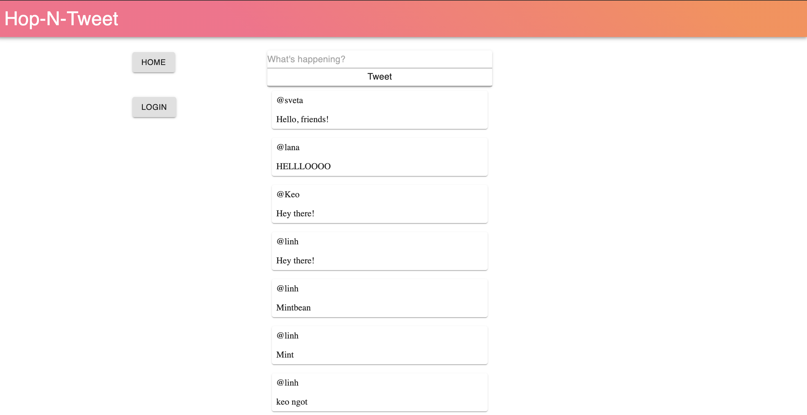
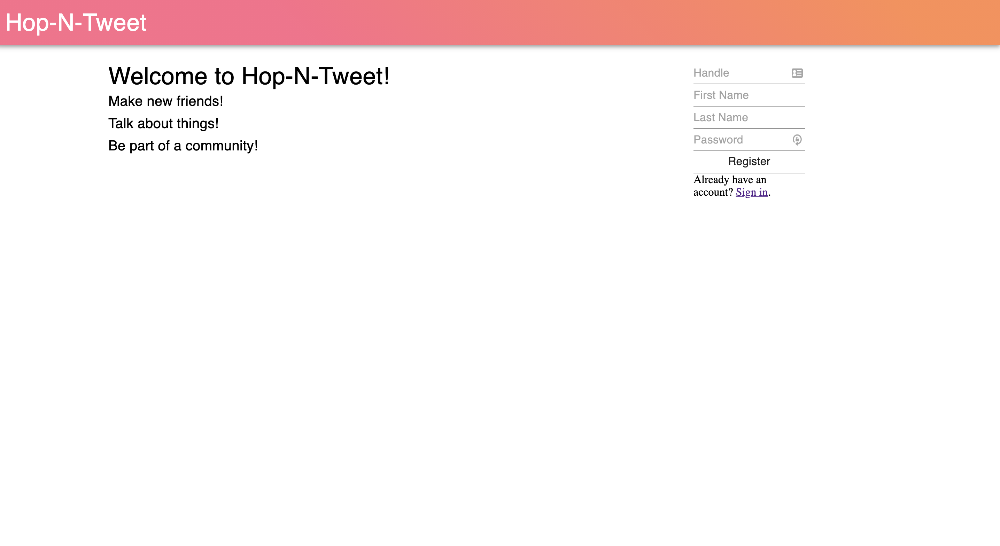
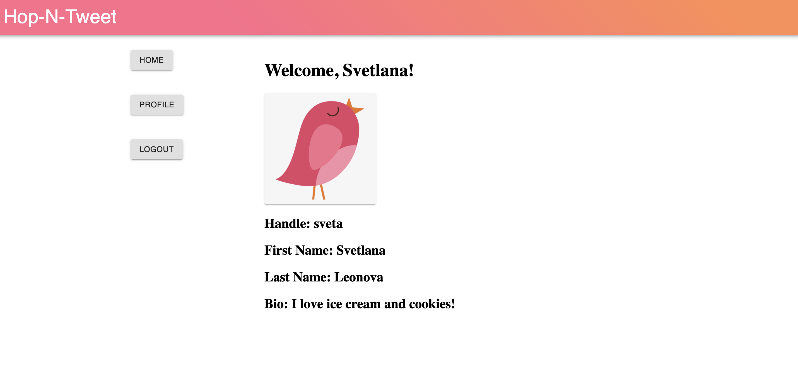

# Hop-n-tweet - overview

This project was built in a week-long sprint as part of the "How to build a social media site" hackathon by Mintbean.

This is a simple twitter-like application that allows logged-in users to exchange messages on a shared dashboard.

In this project, we focused on implementing helpful error handling functionality on both the front and the back end.

An informative error message will pop up in the following cases:

1. user tries to submit an empty tweet
2. user tries to submit a tweet without being logged in
3. user enters wrong handle/password combination
4. user tries to register but hasn't filled out all fields of the registration form
5. user tries to register with a handle that is already in use

## Prerequisites

You need the latest version of Mongo and NPM in order to code on this project.

## Getting started

```bash
yarn install # or npm install
yarn dev # or npm run dev
```

## Setting up database

In order for the project to work in development mode, you need to have mongodb running on a local server. The application will create a `Twitterbean` collection for itself on bootup.

The application can be deployed to port 3000. Changing the port requires a bit of coding.

`WARNING`: This project needs to be deployed at the root of your site. i.e. `http://foo.bar` will work
but `http://foo.bar/baz` most likely will not.

```bash
yarn build
yarn start
```

## Scripts

`yarn dev` will run the dev server for the frontend as well as the backend.
`yarn build` will build the project. It will move the frontend's static assets into the backend's `public` folder.
`yarn start` will run the built backend folder.
`yarn dropdb` will clean the database (you will have to register again)

## Architecture

The project is structured as a [yarn workspaces monorepo](https://medium.com/swlh/yarn-workspaces-monorepo-beginners-guide-ed89de47aa25).
It uses `ts-node` for Typescript support. Typescript is loosely used throughout the project where needed, so there is a mix of Typescript
and JavaScript files in the repository. Please feel free to convert the project to pure JavaScript or pure Typescript should you desire.
Here are the major folders:

`/` contains `.gitignore` and several useful scripts.
`/http` contains API calls that can be called using VSCode's [REST Client](https://marketplace.visualstudio.com/items?itemName=humao.rest-client) extension.
`/packages/frontend` contains the frontend project.
`/packages/backend` contains the backend project.

## Frontend

We are using Parcel Bundler, which simply uses `index.html` as its entrypoint. It automatically parses the `script` tag to find out which JS or TS file it should start with, then stitches together the imports and deploys it to a dev server with hot reload. Once you're ready to build, run `yarn build` from the root of the project and Parcel will automatically build the Frontend project and paste the resulting bundled static assets into `packages/backend/public`

We're using [Material-UI](https://material-ui.com/) as the framework.

We're using the [useReducer](https://alligator.io/react/usereducer/) hook to manage state. We're passing it down without prop-drilling by making good use of the [useContext](https://www.digitalocean.com/community/tutorials/react-usecontext) hook. (check these out, they're super cool and easy to use once you understand them!)

`NOTE` If you encounter a Build Error in dev mode, try a server reset. If that doesn't work, delete the `packages/frontend/.cache` folder, then try resetting the server again.

## Backend

We're using Express and Mongoose/MongoDB on the backend. All code is custom-built, and we're using as few pieces as possible in order to maximize learning potential from this project.

## Preview

Dashboard


Register page


Profile page


[Demo video](https://www.youtube.com/watch?v=sFOfSSwrnPg) 

## Link to deployed application

https://hop-n-tweet.herokuapp.com/
